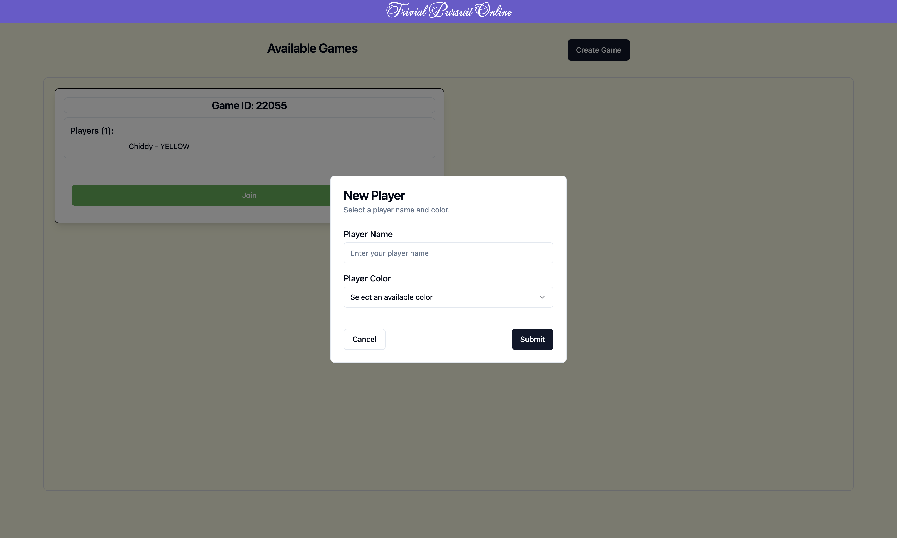
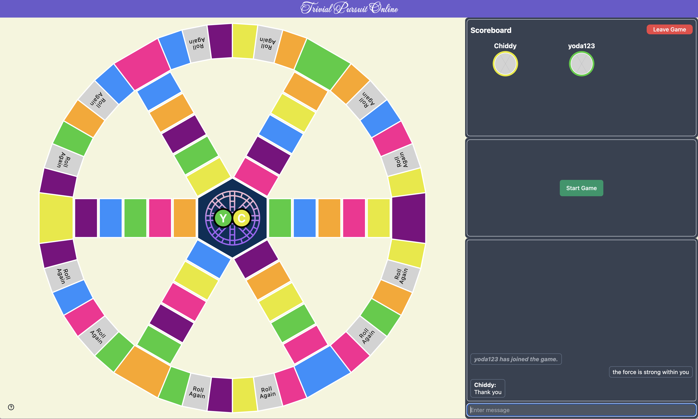
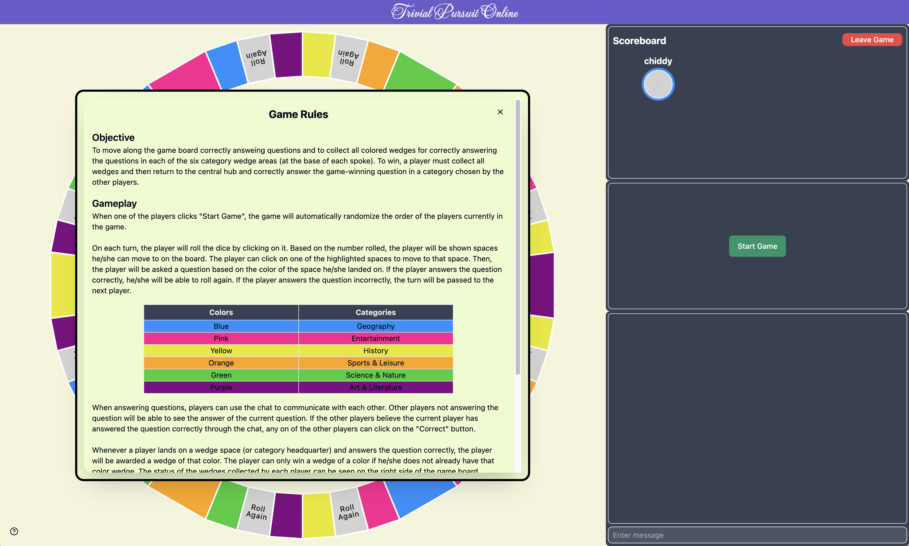
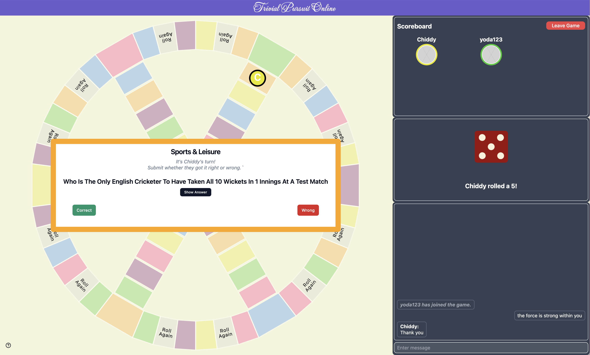
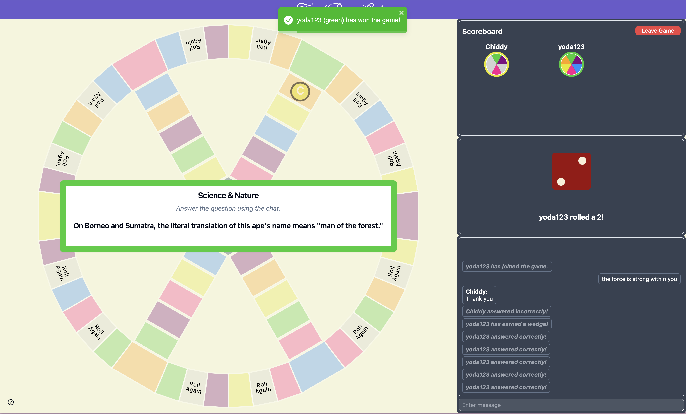
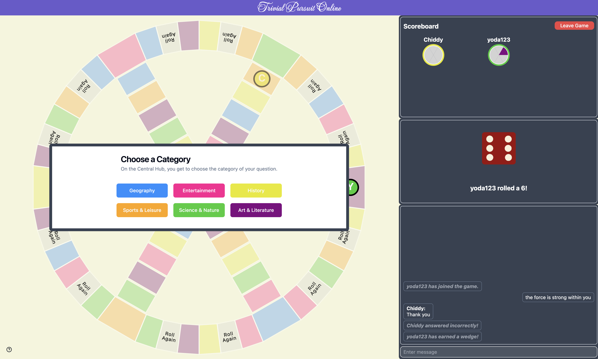

# Trivial Pursuit Online

A real-time online trivia game where players can test their knowledge and compete in a fun, interactive environment. Built with the MERN stack and Socket.io for seamless real-time gameplay.

## Live Demo

[Play Trivial Pursuit Online](https://trivial-pursuit-online-59xk.onrender.com)

## Features

- Real-time multiplayer trivia gameplay with Socket.io.
- Intuitive user interface with dynamic player actions.
- Interactive game board with visual cues for valid moves.
- Customizable player names and colors.
- Mobile-responsive design.

## Technologies Used

- Frontend: React, TailwindCSS
- Backend: Node.js, Express.js
- Database: MongoDB
- Real-Time Communication: Socket.io
- Deployment: Render

## Getting Started

### Prerequisites

- Node.js installed on your machine
- MongoDB Atlas account or local MongoDB instance

### Installation

1. Clone the repository:

```bash
git clone https://github.com/jmin1219/trivial-pursuit-online.git
```

2. Navigate to project directory and install dependencies:

```bash
cd trivial-pursuit-online
npm install
cd client
npm install
```

3. Set up environment variables:

- Create a `.env` file in the root and add:
  ```
  MONGODB_URI=<your-mongodb-connection-string>
  ```

4. Run the development server:

```bash
npm run dev
```

## Screenshots

### Home: Create or Join a Game



### Game Lobby: Chat & Play



### Gameplay









## Contributing

Contributions are welcome! Feel free to open issues or submit pull requests.

## License

This project is for educational purposes only and is not associated with or endorsed by the owners of Trivial Pursuit. The original Trivial Pursuit game and related trademarks are owned by Hasbro, Inc.

The code in this repository is licensed under the MIT License. See the [LICENSE](LICENSE) file for more details.
